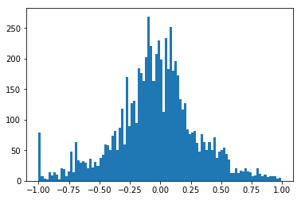
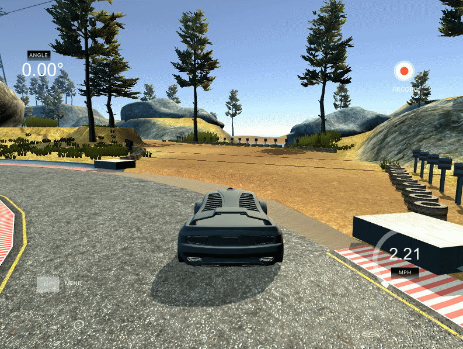
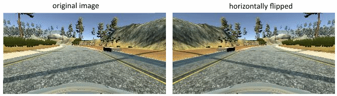
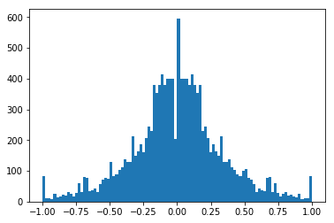
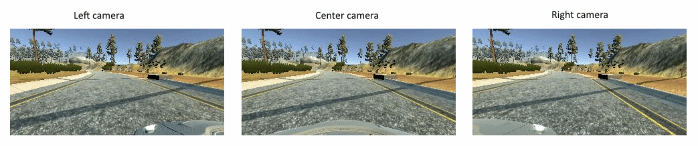
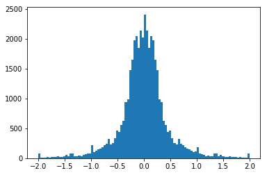

# **Behavioral Cloning** 


This project is MaxEtzo's submission for **Behavioral Cloning* aassignment which is a part of [**Self-Driving Car Engineer Nanodegree's**](https://eu.udacity.com/course/self-driving-car-engineer-nanodegree--nd013) by **Udacity**

The goals / steps of this project are the following:
* Use the simulator to collect data of good driving behavior
* Build, a convolution neural network in Keras that predicts steering angles from images
* Train and validate the model with a training and validation set
* Test that the model successfully drives around track one without leaving the road
* Summarize the results with a written report

## Rubric Points
### Here I will consider the [rubric points](https://review.udacity.com/#!/rubrics/432/view) individually and describe how I addressed each point in my implementation.  

### Files Submitted & Code Quality

#### 1. Submission includes all required files and can be used to run the simulator in autonomous mode

My project includes the following files:
* main.ipynb containing the code to create and train the model
* drive.py for driving the car in autonomous mode (changes: speed set to max=30)
* model.h5 containing a trained convolution neural network 
* README.md summarizing the results

#### 2. Submission includes functional code
Using the Udacity provided simulator and my drive.py file, the car can be driven autonomously around the track by executing 
```sh
python drive.py model.h5
```

#### 3. Submission code is usable and readable

The model.ipynb file contains the code for training and saving the convolution neural network. The file shows the pipeline I used for training and validating the model, and it contains comments to explain how the code works.

### Model Architecture

#### 1. An appropriate model architecture has been employed

NVidia's architecture [link](https://devblogs.nvidia.com/deep-learning-self-driving-cars/) used as a foundation with an additional layer of cropping2D (65-top, and 25-bottom) to remove irrelevant to steering regions. Architecture is implemented in code cell 5 of "main.ipynb". Note that below architecture from original paper is depicted. In our case, input shape is (160,320,3)


#### 2. Attempts to reduce overfitting in the model

The dropout layer with probability of 0.5 is inserted after `flatten`. In addition, L2 regularizer for weights with factor of 0.001 is added for both convolutional and fully connected layers. 

The model was trained and validated on different data sets using generators for training and validation datasets respectively (code cell 2) with 0.8 to 0.2 split. 

#### 3. Model parameter tuning

The model used an adam optimizer, so the learning rate was not tuned manually (code cell 5). Ten epochs were chosen to train the model.
Due to memory limitation mini batches of 64 samples were used for training. Batches were generated with `train_generator` and `valid_generator` respectively (code cell 3)

#### 4. Appropriate training data

Dataset was captured by recording my driving on both tracks, although not distributed evenly. I.e. >80% of the dataset is from track 1, and only the rest from track two. Track 2 helps to generalize better, but also has more sharp turns so complements track 1 with higher angles data. More on the training in the next session.

### Data collection and augmentation

#### 1. Data collection strategy

As many students suggest, it's much harder to train on the data collected with keyboard driving. However, instead of buying joystick I used mouse set to low sensitivity (250 DPI). I still achieved very smooth angle data with such setup. I drove approximately, 2-3 laps on track 1 in both directions, and 1 lap on track 2 only in original direction. 

#### 2. Data normalization

Since, I collected much more data from track 1 with curvatures of big radii, the final dataset is biased towards small steering angles (i.e. -0.5°< ang < 0.5°). In order to normalize the dataset, an upper limit for samples for a steering angle range of 0.04° was set to 200. If number of samples for a steering angle range is above that number, then random 200 is chosen. See code cell 1. Resulting histogram is shown below (ignore the fact that some numbers are above 200. My guess it has to do with the difference between how pyplot builds histogram and how we truncate the dataset):



##### 2a. Note on spike at -1.0:

You can observe a spike at -1.0. That has to do with a certain difficult turn that the model couldn't manage to pass properly (see below). IMO, this happened to sudden change of border Texture.
I decided to specifically generate more data around that turn with high steering angles. As a result, as will be seen in the video, model steers extremely sharp at that turn. This is a clear sign of overfitting (sighs...)



#### 3. Data augmentation 

There are still few challenges with the dataset above, and several techniques were used to overcome them. 

##### Skew and Flipping
It can be observed that the histogram is skewed to the left. The reasons are as follows: 

* Data on track 2 was only collected in one direction
* Data on track 1 was *probably* collected unevenly, i.e. I have collected more data in one direction, than in the other.
* See note 2a above.

In order to avoid bias to the left dataset is augmented with horizontally flipped copies of original samples (see below). Corresponding steering angles are multiplied by -1 as well. Flipping is done in data generator functions: `train_generator` and `valid_generator` in code cell 3. 



The resulting histogram is as follows:



Ignore peak irregularity at 0 (i.e. sudden drop and then high peak): it is due to the fact that samples with steering angle 0° are assigned to `bin[0:0.04°]` and not to `bin[-0.04°:0]`. 

##### Using left and right cameras for center recovery



Dataset is further augmented with left and right cameras with corrected steering angles. As original dataset was collected with smooth center driving, left and right camera augmentation is important for training model for the recovery to the center. See function `steering_correction` in code cell 3. Note that, steering factor depends on the center steering angle but is bounded by 0.15 from below. Overall technique as follows: if center steering angle is to the left, then corrected steering angle for left camera is half of this amount, and for the right - twice the amount; and vice versa. The final histogram is depticted below:



### Final Result!
Here's a [link to my video result](./video.mp4)
